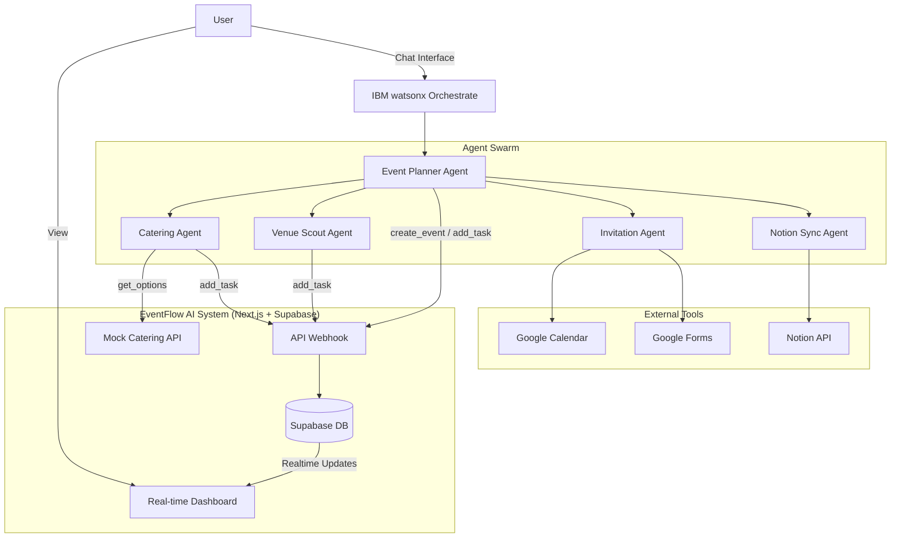

# Architecture Diagram

```mermaid
graph TD
    User[User] -->|Chat Interface| Orchestrate[IBM watsonx Orchestrate]
    
    subgraph "Agent Swarm"
        Planner[Event Planner Agent]
        Venue[Venue Scout Agent]
        Catering[Catering Agent]
        Invite[Invitation Agent]
        Notion[Notion Sync Agent]
    end
    
    Orchestrate --> Planner
    Planner --> Venue
    Planner --> Catering
    Planner --> Invite
    Planner --> Notion
    
    subgraph "External Tools"
        GCal[Google Calendar]
        GForms[Google Forms]
        NotionAPI[Notion API]
    end
    
    Invite --> GCal
    Invite --> GForms
    Notion --> NotionAPI
    
    subgraph "EventFlow AI System (Next.js + Supabase)"
        Webhook[API Webhook]
        DB[(Supabase DB)]
        Dashboard[Real-time Dashboard]
        MockAPI[Mock Catering API]
    end
    
    Planner -->|create_event / add_task| Webhook
    Venue -->|add_task| Webhook
    Catering -->|get_options| MockAPI
    Catering -->|add_task| Webhook
    
    Webhook --> DB
    DB -->|Realtime Updates| Dashboard
    User -->|View| Dashboard
```
